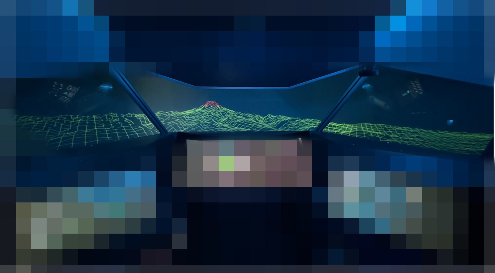
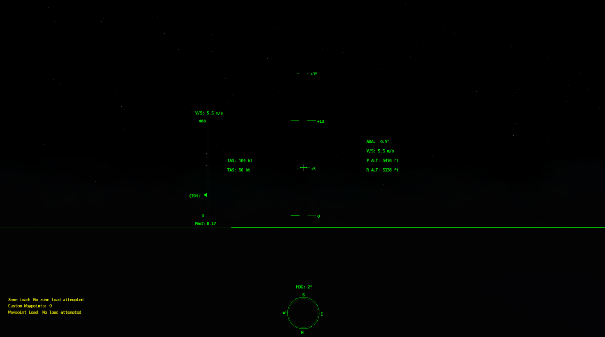
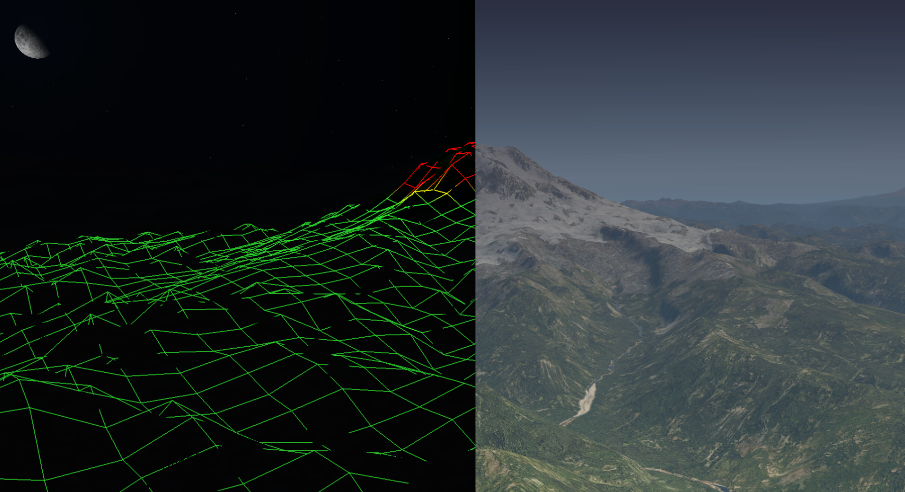

# Boeing Single Pilot Operations Simulator

## 1.0 Overview
A single-pilot cockpit simulator built for **X-Plane** using **Python** (UI & logic) and **C++** (plugin integration).

## 2.0 Features
### 2.1 HUD Overlays
- Pitch/Roll, speed, synthetic horizon, landing assist  

### 2.2 Synthetic Vision
- Terrain visualization in all weather/lighting conditions  

### 2.3 Flight Path Mapping
- Waypoints, airspace zones, traffic visualization  

### 2.4 X-Plane Integration
- Real-time data via DataRefs + OpenGL rendering  

## 3.0 Tech Stack
- **Python** (Qt UI)  
- **C++** (X-Plane SDK, OpenGL)  
- **XPFlightPlanner** for waypoint data  

## 4.0 Contributors
- Ashwin Pillai  
- Joshua Zhu  
